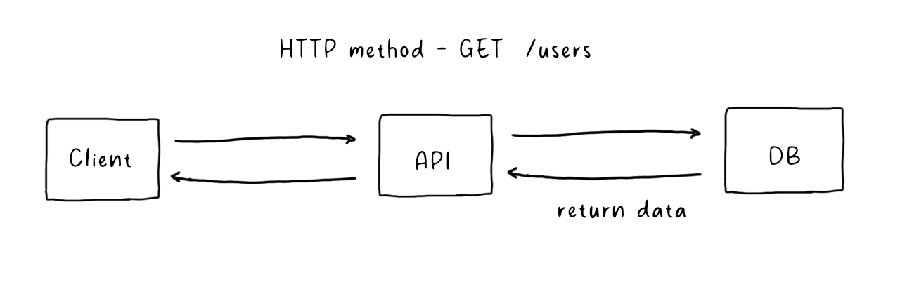
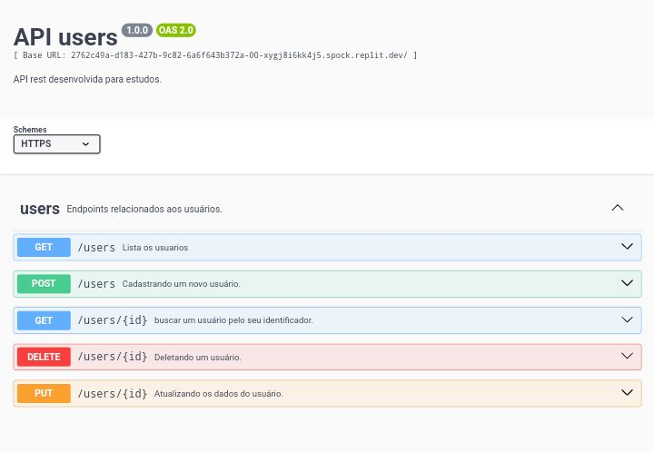

# API REST


Uma API REST(representational state tranfer) é uma interface de comunicação que permite
que diferentes sistemas se comuniquem entre si usando o protocolo HTTP. Em uma API REST os
recursos (como dados de usuarios, produtos e etc...) são  representados por URLs e as operações
para criar, atualizar, deletar e ler estes dados são realizados por meios de metodos HTTP 
como POST, GET, PUT, DELETE e mais...




A ideia deste diretorio é desenvolver um CRUD simples porém completinho com todos os metodos
HTTP, autenticação, testes automatizados, migrações, paginação e mais...


## Rotas disponiveis:


**GET /users/** - metodo usado para recuperar dados do servidor. Ele solicita dados de um recurso 
especifico e retorna uma resposta contendo os dados.

A paginação em uma api rest, é usada para retornar uma lista de dados fracionade em partes menores
ao inves de enviar todos os dados de uma vez. melhorando o desenpenho e usabilidade. os parametros
habilitados são:

- page: o número da página atual, por padrão iniciará na pagina 1.
- limit: indica a quantidade de dados a serem retornados por pagina, por  padrão 5.

```shell
GET /users?page=1&limit=5
```

**OUTPUT**:
```json
{ 
	"users": [
		{"name":"test","email":"test@email.com","id":1},
		{"name":"test","email":"test@email.com","id":2},
		{"name":"test","email":"test@email.com","id":3},
		{"name":"test","email":"test@email.com","id":4},
		{"name":"test","email":"test@email.com","id":5}
	],
	"meta": {
		"path":"/users?page=1&limit=5",
		"page":1,
		"next":2,
		"prev":1,
		"last":5,
		"total":22
	}
}
```

**GET /users/id** - similar ao metodo get, porem retorna somente um usuario de ID correspondente
ou uma mensagem caso o usuario não seja encontrado.

```curl
GET /users/19
```

**OUTPUT**:
```json
{"name":"test", "email":"test@email.com","id":19}
```

## Documentação:

O swagger é uma ferramenta para desenvolver documentação e testes para API REST. A partir
de uma especificação escrita em YAML ou JSON, o swagger ger uma interface interativa que
permite visuallizar e testar os endpoints da API diretamente pelo navegador.

```shell
GET /docs/
```

**Docs /docs/** - Endpoint que dá acesso a documentação da API gerado pelo swagger.



//TODO: DOCUMENTAR PROJETO